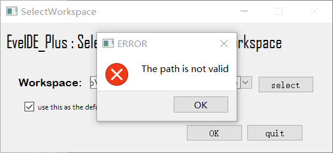
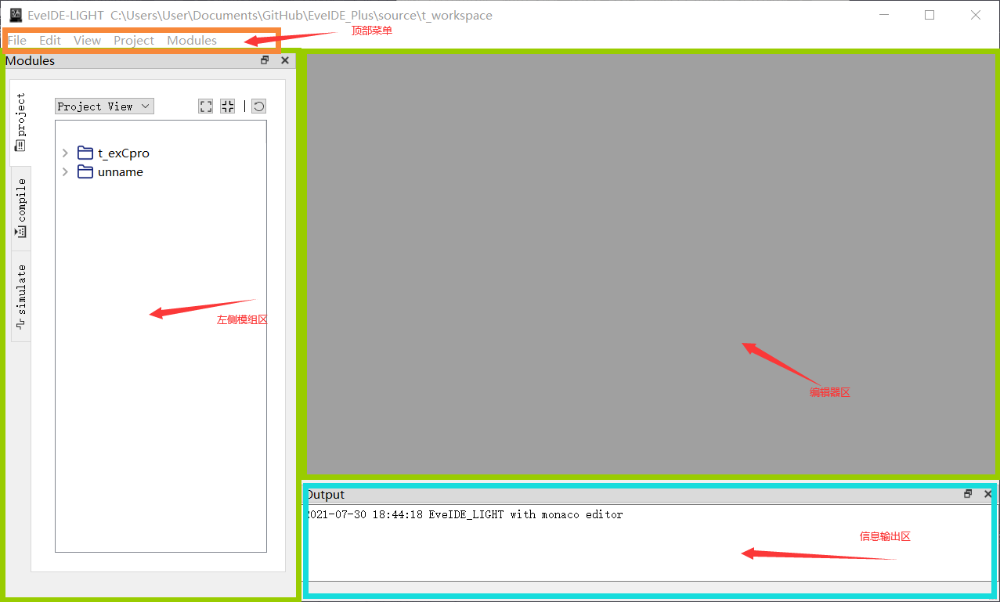

# EveIDE_LIGHT 使用手册(更新中)
  
 
version : v 0.0.1     
author : Adancurusul

<!-- vscode-markdown-toc -->
* 1. [ 概述](#)
	* 1.1. [ 什么是EveIDE_LIGHT](#EveIDE_LIGHT)
* 2. [ 使用介绍](#-1)
	* 2.1. [ 选择工作区](#-1)
	* 2.2. [进入主界面](#-1)
		* 2.2.1. [ 顶部菜单](#-1)
		* 2.2.2. [左侧模组区](#-1)

<!-- vscode-markdown-toc-config
	numbering=true
	autoSave=true
	/vscode-markdown-toc-config -->
<!-- /vscode-markdown-toc -->

##  1.  概述 
###  1.1.  什么是EveIDE_LIGHT
EveIDE_LIGHT 目的是为RiscV核心设计者打造一个轻量化解包即用、快速开发与验证的集成开发环境。
EveIDE_LIGHT目前集成了编辑器，仿真器和烧录器，后期还会添加Git等版本管理模块。打包后可执行文件仅100MB 切能做到解包即用不用配置其他环境

##  2.  使用介绍 
###  2.1.  选择工作区

EveIDE_LIGHT 工程管理方式为工作区，工作区下可以创建或导入多个仿真工程和编译工程，首次打开IDE时会弹出工作区目录选择，只需根据自己需要选择工作区。
可以点击select从文件管理系统中选择文件夹，曾经使用的工作区也可以通过输入框右侧下拉选项选择    
每次启动IDE默认会弹出选择窗口，也可以通过点击左下角设为默认  
选择完工作区后点击OK按钮即可进入IDE主界面,当所选文件夹不存在时IDE会报错    

###  2.2. 进入主界面

选择工作目录后会进入到主界面，主界面由顶部菜单栏，左侧模组区，右侧编辑器和下部输出区域组成，EveIDE_LIGHT 本着轻量化易使用原则采用扁平化ui设计，不会有过多弹窗弹出，主要逻辑功能都在主界面可以快速使用

####  2.2.1.  顶部菜单 
#####  文件
#####  视图
##### 工程           
#####  模组

####  2.2.2. 左侧模组区
左侧模组区由工程视图区，编译区和仿真区组成
#####  工程视图
工程视图提供了工作区下包含的所有编译工程的树状视图右上角三个按键分别是：展开所有节点、收缩所有节点和刷新树状视图   
   
点击展开所有节点后树状视图会被完全展开，点击收缩后节点会自动收缩，刷新树状视图可以重新扫描文件获得新的树状结构。   
这里以两个示例工程为例介绍下树状结构

  

树状结构在折叠状态为工程列表，对于所有目录下有文件的文件夹都可以通过双击或者点击小箭头打开与折叠，对于IDE支持查看的文件和能打开的文件夹都会在名字前加上图标。   

    
所有节点右键都会弹出删除节点的选项，点击删除后会弹出警告，选择yes：文件夹会连同内部文件一同被删除，文件会被直接删除选择No则不会做任何操作。   
对于c语言，EveIDE_LIGHT有一套函数识别机制（有待优化）可以帮助使用者更加直观的看到c语言下的函数，并可以通过双击函数打开该文件，同时IDE目前仅支持打开UTF-8的文件格式，其他格式会报错并无法打开，双击会产生报错警告   
   

#####  编译设置
点击左侧模组视图左边的第二个标签会进入到编译设置页面，编译后IDE会保存该工程的配置    
   
最上方左侧是工程选择，可以点击展开下拉列表选取需要编译的工程名字    
      
可以在toolchain那一栏配置自己的工具链，可以将自己的工具链bin文件路径填入，IDE会自动识别工具链前缀，如该目录下无gcc工具则会在点击编译后抛出警告并停止编译   
      

gcc选择下面为指令集选择，可以根据自己工程的指令集来选择

